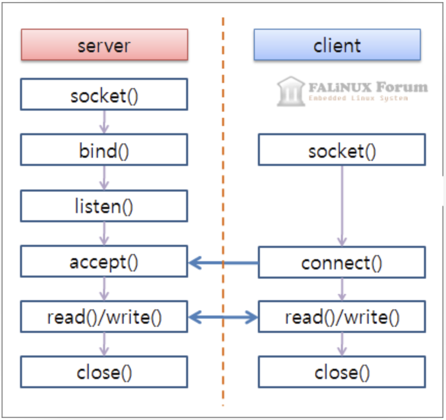
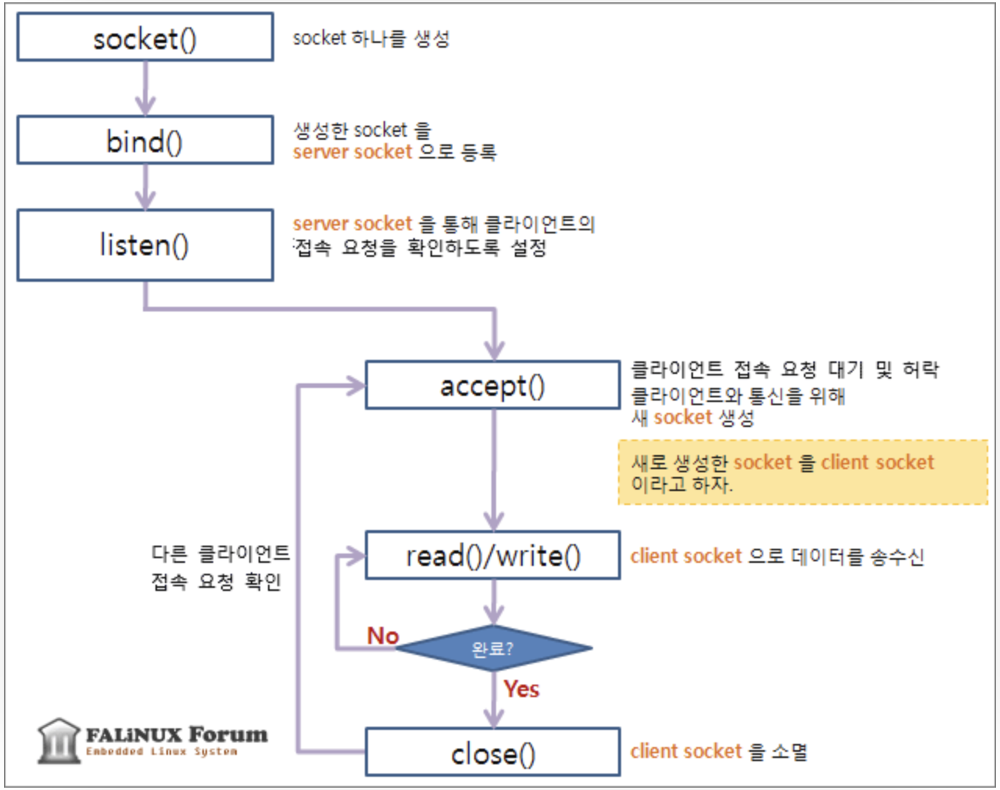
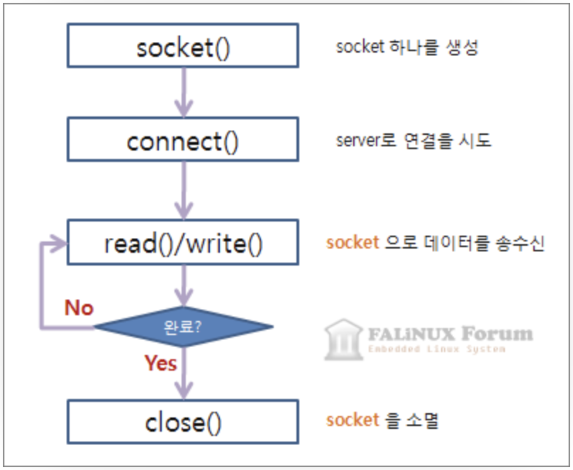

# irc
+ irc 프로토콜을 사용한 채팅 서버를 구현하는 프로젝트

## 소켓 통신
+ TCP/IP 통신 과정
	+ 
	+ server
		+ 
	+ client
		+ 
+ 주요 사용 함수
	1. socket(int domain, int type, int protocol)
		+ 소켓을 만드는데 바로 이 함수를 사용합니다. 소켓 역시 파일로 다루어지기 때문에 반환값은 파일디스크립터입니다. 만약 소켓을 여는데 실패했다면 -1을 리턴합니다.
		+ 인자
			+ int domain : 인터넷을 통해 통신할 지, 같은 시스템 내에서 프로세스 끼리 통신할 지의 여부를 설정합니다.  
				PF_INET, AF_INET :	IPv4 인터넷 프로토콜을 사용합니다.  
				PF_INET6 :	IPv6 인터넷 프로토콜을 사용합니다.  
				PF_LOCAL, AF_UNIX :	같은 시스템 내에서 프로세스 끼리 통신합니다.  
				PF_PACKET :	Low level socket 을 인터페이스를 이용합니다.  
				PF_IPX :	IPX 노벨 프로토콜을 사용합니다.  
			+ int type : 데이터의 전송 형태를 지정하며 아래와 같은 값을 사용할 수 있습니다.  
				SOCK_STREAM :	TCP/IP 프로토콜을 이용합니다.  
				SOCK_DGRAM :	UDP/IP 프로토콜을 이용합니다.  
	2. connect(int fd, struct sockaddr *remote_host, socklen_t addr_length)
		+ 원격 호스트(원격 컴퓨터)와 연결하는 함수입니다. 연결된 정보는 remote_host에 저장됩니다. 성공시 0, 오류시 -1을 반환합니다.
	3. bind(int fd, struct sockaddr *local_addr, socklen_t addr_length)
		+ 소켓을 바인딩합니다. 이렇게 생각하면 됩니다. 지금 fd로 넘겨지는 소켓과 이 프로세스와 묶는다(bind)라고 생각하시면 됩니다. 그래서 해당 프로세스는 소켓을 통해 다른 컴퓨터로부터 연결을 받아들일 수 있습니다.
	4. listen(int fd, int backlog_queue_size)
		+ 소켓을 통해 들어오는 연결을 듣습니다. backlog_queue_size만큼 연결 요청을 큐에 넣습니다. 성공시 0, 오류시 -1을 반환합니다.
	5. accept(int fd, sockaddr *remote_host, socklen_t *addr_length)
		+ 어떤 컴퓨터에서 이 컴퓨터로 연결할때 연결을 받아들입니다. 함수 이름이 말해주고 있죠. 연결된 원격 컴퓨터의 정보는 remote_host에 저장됩니다. 오류시에 -1을 반환합니다.
	6. send(int fd, void* buffer, size_t n, int flags)
		+ buffer를 소켓 파일 디스크립터인 fd로 전송합니다. 보낸 바이트수를 반환하며 실패시 -1을 반환합니다.
	7. recv(int fd, void* buffer, size_t n, int flags)
		+ send함수와 사용법이 거의 비슷합니다. n바이트를 buffer로 읽습니다. 성공시 받은 바이트수를 반환하며 실패시 -1을 반환합니다.